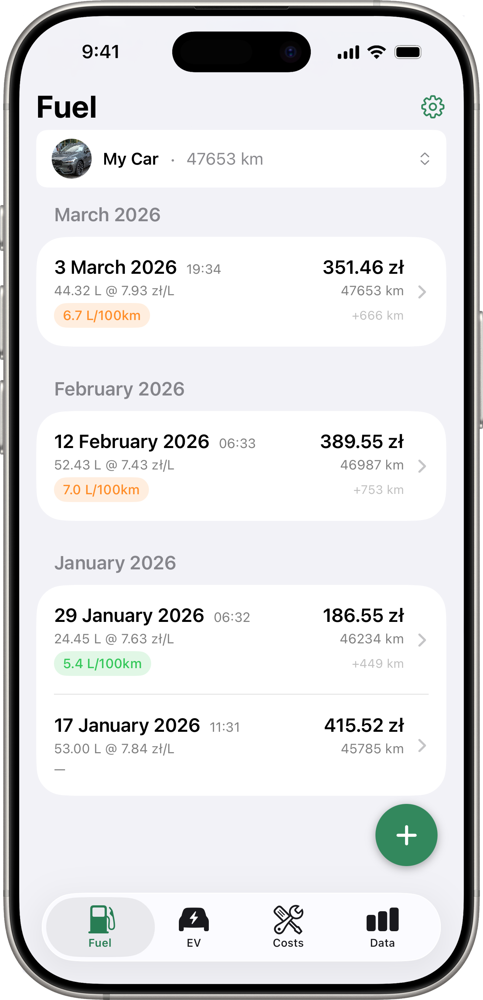

# Drivest Web

<p align="center">
  <picture>
    <source media="(prefers-color-scheme: dark)" srcset="static/images/appstore/dark.png">
    
  </picture>
</p>

Landing page and website for [Drivest](https://www.drivest.app) — a vehicle cost and fuel tracking app for iOS.

## Stack

- **Static site generator**: [Hugo](https://gohugo.io)
- **Theme**: [PaperMod](https://github.com/adityatelange/hugo-PaperMod) (customized)
- **Hosting**: GitHub Pages
- **CI/CD**: GitHub Actions

## Getting Started

```bash
git clone https://github.com/andrzejsiemion/drivest-web.git
cd drivest-web
hugo server -D
```

Open [http://localhost:1313](http://localhost:1313) to preview locally.

### Requirements

- [Hugo](https://gohugo.io/installation/) (extended edition)

## Project Structure

```
layouts/
  index.html          — landing page
  privacy/single.html — privacy policy page
  partials/           — shared partials (footer, head extensions)
assets/css/extended/  — custom CSS (landing page styles)
static/images/        — logos, app screenshots
graphics/appstore/    — source App Store screenshots (light/dark)
```

## Deployment

Pushes to `main` trigger a GitHub Actions workflow that builds the site and deploys to GitHub Pages at [drivest.app](https://www.drivest.app).

## Related

- [drivest-ios](https://github.com/andrzejsiemion/drivest-ios) — the iOS app

## License

MIT — see [LICENSE](LICENSE)

## Author

Andrzej Siemion — [@andrzejsiemion](https://github.com/andrzejsiemion) — [drivest.app](https://www.drivest.app)
